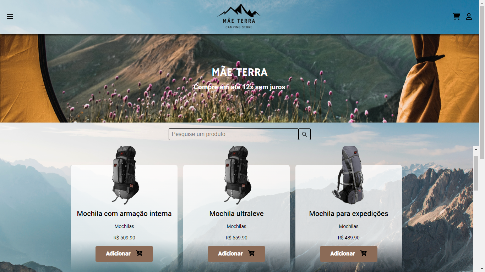

<h1 align="center"> Mãe Terra </h1>

<p align="center">
  Replicação do projeto Mãe Terra com Typescript e React.<br/>
</p>

<p align="center">
  <a href="#-tecnologias">Tecnologias</a>&nbsp;&nbsp;&nbsp;|&nbsp;&nbsp;&nbsp;
    <a href="#-instalacao-do-projeto">Instalação do projeto</a>&nbsp;&nbsp;&nbsp;|&nbsp;&nbsp;&nbsp;
  <a href="#-sobre-o-projeto">Sobre o Projeto</a>&nbsp;&nbsp;&nbsp;
</p>

<p align="center">
  
</p>

<p align="center">
  <a href="https://mae-terra-react.vercel.app/" target="_blank">➡️ Acesse o deploy!</a>
</p>

## 🚀 Tecnologias

Esse projeto foi desenvolvido com as seguintes tecnologias:

- React
- Typescript
- Material UI
- React Hook Forms

## ⚙️ Instalação do projeto

Passo-a-passo:

1. Comandos necessários para executar:

```
npm i
npm run dev
```

> Particularidades do projeto. Dependência externa.

## 💻 Sobre o Projeto

Este projeto é uma loja especializada em vendas de produtos para camping e aventura, que já existia em JS Vanilla e foi proposto a atualização dele com as tecnologias React e Typescript.
